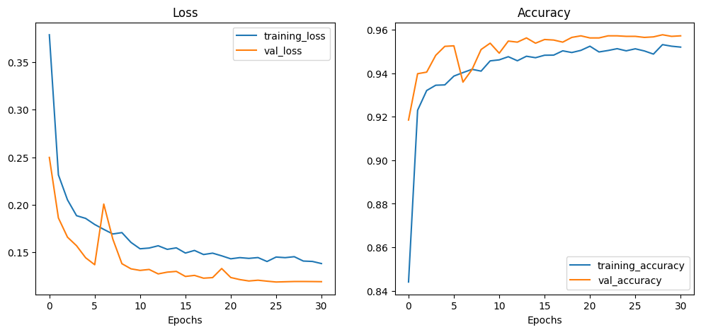
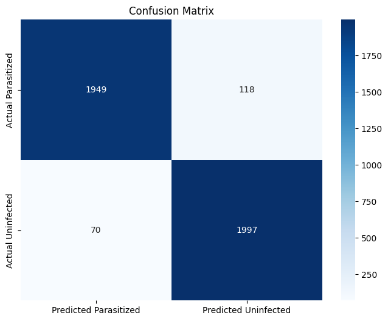
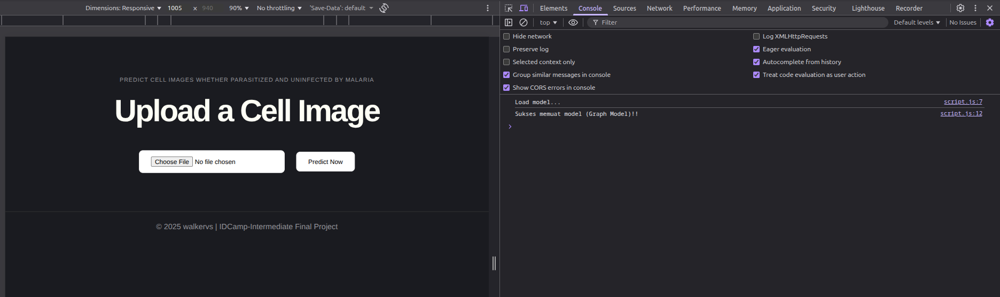
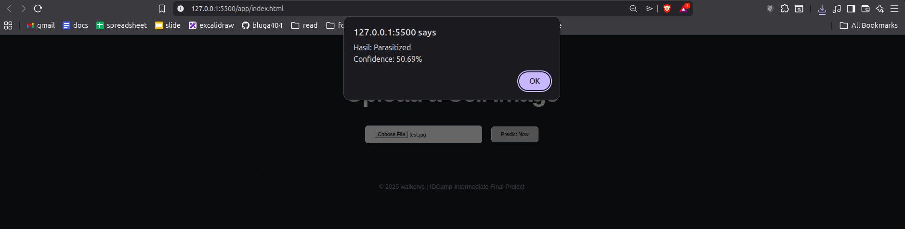
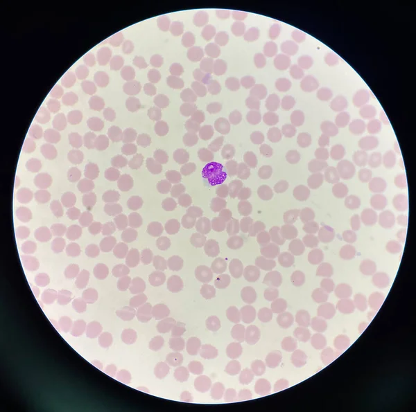

  <h2 align="center">Malaria Cell Detection</h2>

  

    IDCamp Intermediate Final Project
  

<!-- ABOUT THE PROJECT -->
#### About The Project

This project focuses on the development of a Deep Learning solution for the automated detection of Malaria in blood smear images. Malaria remains a significant global health challenge, and traditional manual microscopic examination is time-consuming and prone to human error. This project leverages Computer Vision to provide a fast and objective diagnostic tool. The primary objective is to classify thin blood smear cell images into two categories: 
* **Parasitized**, Cells containing the Plasmodium parasite, indicating an active malaria infection.
* **Uninfected**, Healthy red blood cells with no signs of infection.

#### Built With

Framework/libraries used

* [![TensorFlow][TensorFlow.js]][TensorFlow-url]
* [![Pandas][Pandas.py]][Pandas-url]
* [![Jupyter][Jupyter.org]][Jupyter-url]
* [![Scikit-Learn][Scikit-Learn.org]][Scikit-Learn-url]

<!-- GETTING STARTED -->
#### Getting Started

The dataset used obtained from [Tensorflow Malaria Dataset](https://www.tensorflow.org/datasets/catalog/malaria).

- **Dataset row:** 27,558 rows
- **Data Split:** 70% Training, 15% validation, 15% Testing
- **Preprocessing:** Load Image, Split Folders (train,val,test), Augment Train Data

## Model used
To achieve the best results, this project conducted experiments using Transfer Learning by combining pretrained model `MobileNetV2` with Model Sequential, Conv2D, Pooling Layer.

#### MobileNetV2
This model is a very simple network architecture that allowed us to build a family of highly efficient mobile models. Model's basic building unit, has several properties that make it particularly suitable for mobile applications. It allows very memory-efficient inference and relies utilize standard operations present in all neural frameworks. [Read the Paper here.](https://arxiv.org/pdf/1801.04381)

#### Model Sequential, Conv2D, Pooling Layer
The custom classifier head of this project is built using a Sequential API, which allows for a linear stack of layers designed to interpret the complex features extracted by the MobileNetV2 base.

| Layer Type | Configuration | Purpose |
| :--- | :--- | :--- |
| **Base Model** | MobileNetV2 (Frozen) | High-level feature extraction using pretrained weights from ImageNet. |
| **Convolutional** | 32, 64, 128 filters (3x3) | Spatial pattern detection to identify parasite spots and cell textures. |
| **Max Pooling** | 2x2 pool size | Dimensionality reduction to reduce computational load and control overfitting. |
| **Dropout** | 0.5 rate | Regularization technique to prevent overfitting by randomly deactivating neurons. |
| **Output Layer** | Sigmoid (1 unit) | Binary classification to determine if a cell is Parasitized or Uninfected. |

#### Callbacks
* **Early Stopping**: Automatically terminates training if the `val_loss` fails to improve for **5 consecutive epochs**. It ensures the model retains the best weights (`restore_best_weights=True`) found during the process.
* **ReduceLROnPlateau**: Dynamically reduces the learning rate by a **factor of 0.2** if the `val_loss` plateaus for **3 epochs**. This allows the model to take smaller, more precise steps toward the global minimum.

| Callback | Monitor | Patience | Primary Action |
| :--- | :--- | :--- | :--- |
| **Early Stopping** | `val_loss` | 5 | Stops training & restores best weights |
| **Reduce LR** | `val_loss` | 3 | Reduces Learning Rate (LR * 0.2) |

## Results & Plot Loss

#### Accuraccy and Loss

| Model | Training Accuracy | Testing Accuracy | Training Loss | Testing Loss |
| :--- | :--- | :--- | :--- | :--- |
| MobileNetV2 | 95 | 95 | 0.1406 | 0.1359|

#### Plot Loss

#### Confusion Matrix

<!-- INFERENCE -->
## Inference using TFJS model
#### Display

#### Prediction Result

#### Test image (outside train and test data) [source](https://depositphotos.com/id/photo/malaria-blood-parasite-infected-red-blood-cells-laboratory-background-582674984.html)

<!-- LICENSE -->
## License

Feel free to collaborate and modify!

<!-- ACKNOWLEDGMENTS -->
## Acknowledgments

Resources i find helpful and would like to give credit to.

* [Huggingface](https://huggingface.co/)
* [Tensorflow](https://www.tensorflow.org/)
* [Dicoding](https://www.dicoding.com/)

<!-- MARKDOWN LINKS & IMAGES -->
<!-- https://www.markdownguide.org/basic-syntax/#reference-style-links -->
[TensorFlow.js]: https://img.shields.io/badge/TensorFlow-%23FF6F00.svg?style=for-the-badge&logo=TensorFlow&logoColor=white
[TensorFlow-url]: https://www.tensorflow.org/

[Pandas.py]: https://img.shields.io/badge/pandas-%23150458.svg?style=for-the-badge&logo=pandas&logoColor=white
[Pandas-url]: https://pandas.pydata.org/

[Jupyter.org]: https://img.shields.io/badge/Jupyter-%23F37626.svg?style=for-the-badge&logo=Jupyter&logoColor=white
[Jupyter-url]: https://jupyter.org/

[Transformers.hw]: https://img.shields.io/badge/%F0%9F%A4%97%20Transformers-blue?style=for-the-badge
[Transformers-url]: https://huggingface.co/docs/transformers/index

[Scikit-Learn.org]: https://img.shields.io/badge/scikit--learn-%23F7931E.svg?style=for-the-badge&logo=scikit-learn&logoColor=white
[Scikit-Learn-url]: https://scikit-learn.org/